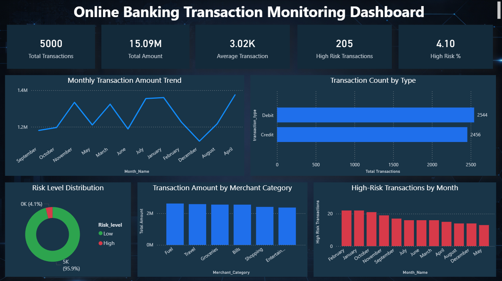
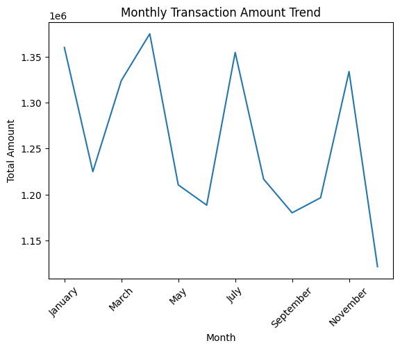
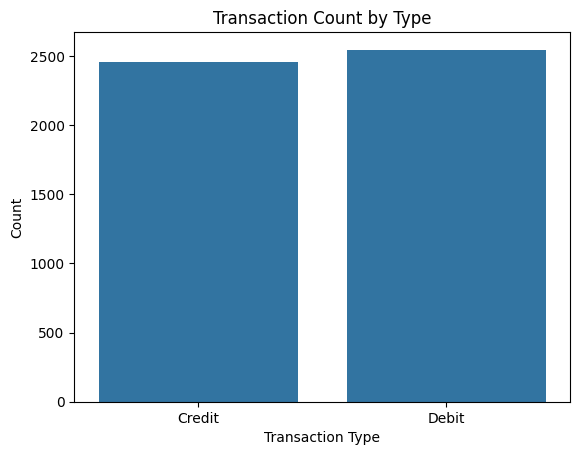
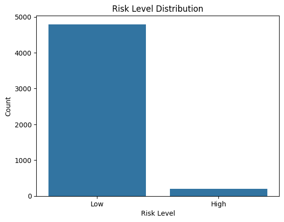
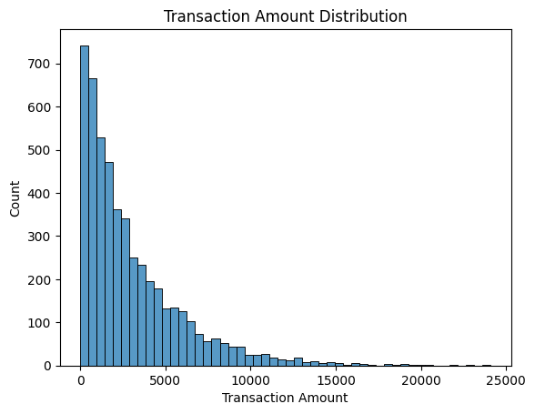
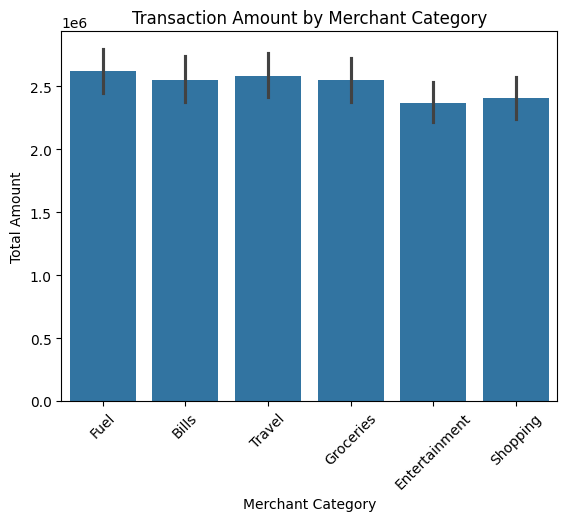
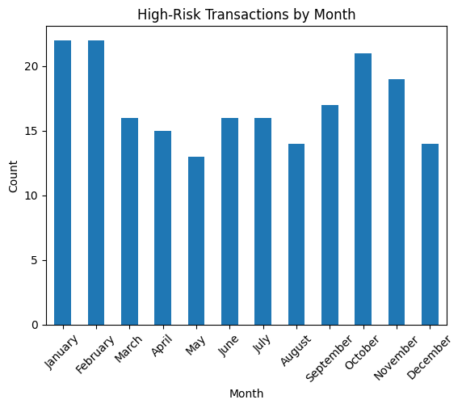

# 📊 Online Banking Transaction Monitoring Dashboard

## 📌 Project Overview

This project demonstrates an end-to-end **Online Banking Transaction Monitoring System** designed to analyze transaction behavior, identify high-risk transactions, and visualize insights using a **single-page Power BI dashboard**.

---

## 🎯 Business Objective

- Monitor online banking transactions

- Detect high-risk and suspicious transactions

- Analyze trends by time, type, and merchant category

- Support fraud monitoring and decision-making

---

## 🧰 Tools & Technologies

- **Python** (Pandas, NumPy, Matplotlib, Seaborn)

- **MySQL** (Data storage & querying)

- **Power BI** (Dashboard & KPIs)

- **Excel** (Initial data inspection)

---

## 🗂️ Project Structure

Online_Banking_Transaction_Monitoring/

│

├── data/

│   ├── raw/

│   ├── processed/

│   └── analytics/

│

├── python/

│   ├── data_cleaning.py

│   ├── transformation_and_risk_modeling.py

│   └── eda_analysis.py

│

├── sql/

│   ├── schema.sql

│   └── data_import.sql

│

├── powerbi/

│   └── Online_Banking_Transaction_Monitoring_Dashboard.pbix

│

├── images/

│   ├── dashboard.png

│   ├── monthly_trend.png

│   ├── transaction_type.png

│   ├── risk_distribution.png

│   ├── merchant_category.png

│   └── high_risk_monthly.png

│

├── docs/

│   └── project_overview.txt

---

## 🖥️ Executive Dashboard for Transaction Monitoring

---

## 📊 Exploratory & Analytical Visualizations

### 🔹 Monthly Transaction Amount Trend

---

### 🔹 Transaction Count by Type

---

### 🔹 Risk Level Distribution

---

### 🔹 Transaction Amount Distribution

---

### 🔹 Transaction Amount by Merchant Category

---

### 🔹 High-Risk Transactions by Month

---

## 🔍 Key Insights

- Transaction volume shows clear monthly patterns

- Debit transactions slightly exceed credit transactions

- Certain merchant categories account for higher transaction amounts

- High-risk transactions are concentrated in specific months

---

## 🏁 Final Outcome

A **Power BI dashboard** that provides:

- Transaction volume monitoring

- Risk exposure analysis

- Fraud trend identification

---

## 👤 Author

**Sri Ram**  

Aspiring Data Analyst | Python | SQL | Power BI  

---

